<div align="center">

# 🛡️ RansomShield

### Hardware-Rooted Ransomware Detection for Embedded Systems

*Secure boot you can trust. Detection that runs at the edge. Alerts that reach your phone in seconds.*

[](LICENSE)


<sub>Built and validated on real hardware — oscilloscope-verified DSP, live-signal analysis, and end-to-end encrypted telemetry.</sub>

</div>

<br>

<div align="center">

### 🎬 Watch it in action

<!--
STEP 1: Upload your video by dragging it into this README file
        directly in the GitHub web editor (Add file → Edit → drag & drop).
        GitHub will auto-generate a link like:
        https://github.com/user-attachments/assets/xxxxxxxx-xxxx-xxxx-xxxx-xxxxxxxxxxxx
        Paste that link below, replacing the placeholder.
STEP 2 (backup): also drop the raw file at docs/demo.mp4
-->

https://github.com/user-attachments/assets/PASTE-VIDEO-ASSET-ID-HERE

**[▶ 60-second demo](#-demo-video)** · **[🏗 Architecture](#-how-it-works)** · **[⚡ Quick Start](#-quick-start)** · **[🖼 Gallery](#-gallery)**

</div>

---

## 📋 Table of Contents

<details open>
<summary><b>Click to expand / collapse</b></summary>

- [Why RansomShield](#-why-ransomshield)
- [How It Works](#-how-it-works)
- [Repository Layout](#-repository-layout)
- [Quick Start](#-quick-start)
  - [1. Flash the Secure Bootloader](#1-flash-the-secure-bootloader)
  - [2. Sign & Flash the Application](#2-sign--flash-the-application)
  - [3. Bring Up the Gateway](#3-bring-up-the-gateway)
  - [4. Train / Retrain the Model](#4-train--retrain-the-model)
- [Gallery](#-gallery)
- [Tech Stack](#-tech-stack)
- [Roadmap](#-roadmap)
- [License](#-license)

</details>

---

## 💡 Why RansomShield

> Most ransomware detection lives in software, on the very OS that's being attacked. RansomShield moves detection **off the host and into hardware** — an independent, cryptographically-attested device that watches system telemetry and can't be silenced by the malware it's trying to catch.

<table>
<tr>
<td width="33%" valign="top">

### 🔐 Trust the Boot
ECDSA-P256 signature verification before a single instruction of application code runs. A tampered image simply never executes.

</td>
<td width="33%" valign="top">

### 🧠 Detect at the Edge
A neural network trained on hardware-calibrated, multi-modal sensor telemetry runs **on the MCU itself** — no cloud round-trip, no dependency on a potentially-compromised host.

</td>
<td width="33%" valign="top">

### 📡 Alert Instantly
An ECDH-encrypted link to an ESP32 gateway pushes real-time alerts to **Telegram** and live dashboards to **ThingSpeak**.

</td>
</tr>
</table>

---

<div align="center">

### 📟 Live Detection, End to End

<table>
<tr>
<td width="33%" align="center">
<br>
<sub><b>Bench rig</b> — sensors, MCU, ESP32 gateway</sub>
</td>
<td width="33%" align="center">
<br>
<sub><b>Telemetry spikes</b> as an attack triggers</sub>
</td>
<td width="33%" align="center">
<br>
<sub><b>Anomaly score</b> alerted live on Telegram</sub>
</td>
</tr>
</table>

</div>

---

## 🏗 How It Works

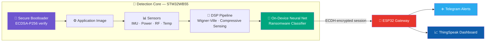

<details>
<summary><b>🔍 Expand: what each stage actually does</b></summary>

| Stage | Component | Role |
|---|---|---|
| 1 | **Secure Bootloader** (`firmware/secure_boot`, `firmware/bootloader`) | Verifies the ECDSA-P256 signature of the application image before jumping to it. Rejects unsigned or tampered images. |
| 2 | **Sensors** (`firmware/ransomware_detection_core/Application/Sensors`) | IMU (MPU6050/LIS3DH), power (INA219), RF (SI4432/NRF24), temperature (NTC), and more feed multi-modal telemetry into the pipeline. |
| 3 | **DSP Pipeline** (`Application/DSP`) — `wvd.c`, `cs.c`, `dsp.c` | Wigner-Ville Distribution for time-frequency analysis + compressive sensing to reduce dimensionality before inference. |
| 4 | **AI Inference** (`Application/AI`) | A compact neural net (weights baked into `ransomware_weights.h`) classifies the processed signal as benign or ransomware-like, entirely on-device. |
| 5 | **Secure Channel** (`Application/Security`) — `ecdh.c`, `session.c`, `comm_encryption.c` | Establishes an ECDH key exchange with the gateway and encrypts all outbound telemetry/alerts. |
| 6 | **Gateway** (`gateway/esp32_gateway_ECDH.ino`) | ESP32 completes the ECDH handshake, decrypts telemetry, and relays alerts to Telegram + live metrics to ThingSpeak. |

</details>

---

## 📁 Repository Layout

<details>
<summary><b>📂 Click to expand full tree</b></summary>

```
RansomShield/
├── docs/                          # 🎥 put the demo video here → docs/demo.mp4
├── firmware/
│   ├── secure_boot/               # Standalone secure boot bring-up project
│   ├── bootloader/                # Bootloader + DSP libs (verifies & chains to app image)
│   └── ransomware_detection_core/ # Main application: sensors, DSP, AI inference, security
│       ├── Application/
│       │   ├── AI/                # Model weights + inference engine
│       │   ├── DSP/                # Wigner-Ville + compressive sensing
│       │   ├── Security/           # ECDH, session mgmt, encryption
│       │   ├── Sensors/            # Sensor drivers
│       │   └── Communication/      # ESP32 link (host side)
│       └── tools/                 # Weight-conversion scripts (Keras → C headers)
├── gateway/
│   └── esp32_gateway_ECDH.ino     # ESP32 gateway: ECDH session, Telegram/ThingSpeak relay
├── matlab/
│   ├── dsp_robustness_analysis.m
│   └── security_pipeline_robustness_analysis.m
├── ml/
│   ├── ai_google_collab_notebook/ # Model training notebook
│   └── data_set/                  # Training dataset (CSV)
├── tools/
│   ├── firmware_image_security_sign_tool/     # keygen.py, sign_image.py
│   └── ransomware_behaviour_generation_tool/  # Synthetic ransomware-behavior generator
├── media_pics/                    # 🖼 All README/report images — see Gallery below
├── firmware.zip                   # Pre-built firmware bundle
└── LICENSE                        # Apache 2.0
```

</details>

---

## ⚡ Quick Start

### 1. Flash the Secure Bootloader

```bash
# Open firmware/secure_boot (or firmware/bootloader) in STM32CubeIDE,
# or build via the provided Makefile
cd firmware/secure_boot
make
# Flash STM32WB55RGVX_FLASH.ld target via ST-Link
```

### 2. Sign & Flash the Application

```bash
cd tools/firmware_image_security_sign_tool
python keygen.py                 # generates ECDSA-P256 keypair
python sign_image.py <your_app.bin>   # signs the ransomware_detection_core image
```
Flash the **signed** image — the bootloader rejects anything else.

### 3. Bring Up the Gateway

```cpp
// gateway/esp32_gateway_ECDH.ino
const char* WIFI_SSID     = "...";
const char* WIFI_PASSWORD = "...";
const char* TELEGRAM_TOKEN = "...";
const char* THINGSPEAK_API_KEY = "...";
```
Flash to an ESP32 via Arduino IDE / PlatformIO. It performs the ECDH handshake automatically on boot.

### 4. Train / Retrain the Model

```bash
# Dataset:   ml/data_set/ransomware_dataset_3k_55_45 .csv
# Notebook:  ml/ai_google_collab_notebook/AI_Model_Notebook

# After training, convert weights for on-device inference:
cd firmware/ransomware_detection_core/tools
python export_weights_kaggle.py
python generate_keras_weights_h.py    # → Application/AI/ransomware_weights.h
```

<details>
<summary><b>🔬 Reproduce the MATLAB robustness analysis</b></summary>

```matlab
>> run('matlab/dsp_robustness_analysis.m')
>> run('matlab/security_pipeline_robustness_analysis.m')
```
See results in the [Gallery](#-gallery) below.

</details>

---

## 🖼 Gallery

<details open>
<summary><b>🏗 System Architecture & Workflow</b></summary>
<br>

<p align="center">

</p>
<p align="center"><i>End-to-end device architecture</i></p>

<p align="center">

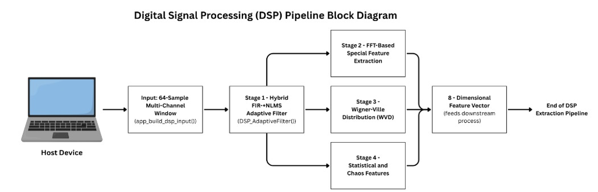
</p>
<p align="center"><i>Overall workflow (left) · DSP pipeline detail (right)</i></p>

<p align="center">
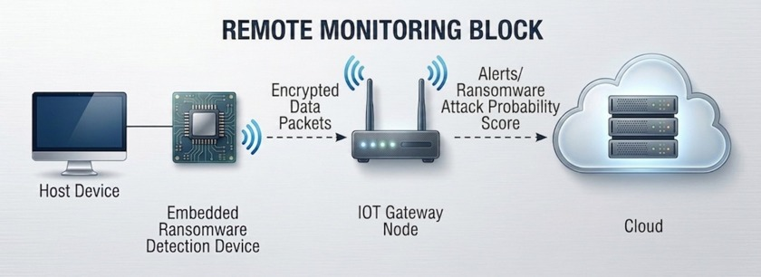
</p>
<p align="center"><i>Remote monitoring block diagram</i></p>

</details>

<details>
<summary><b>🔧 Hardware</b></summary>
<br>

<p align="center">
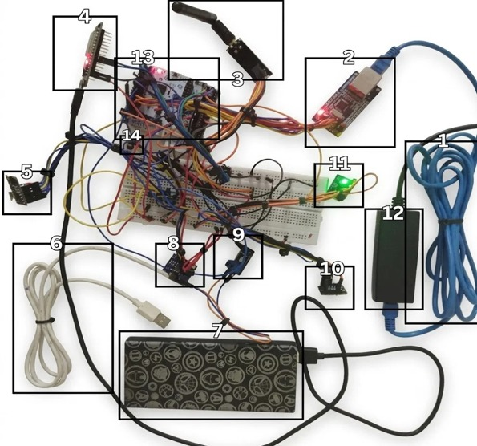
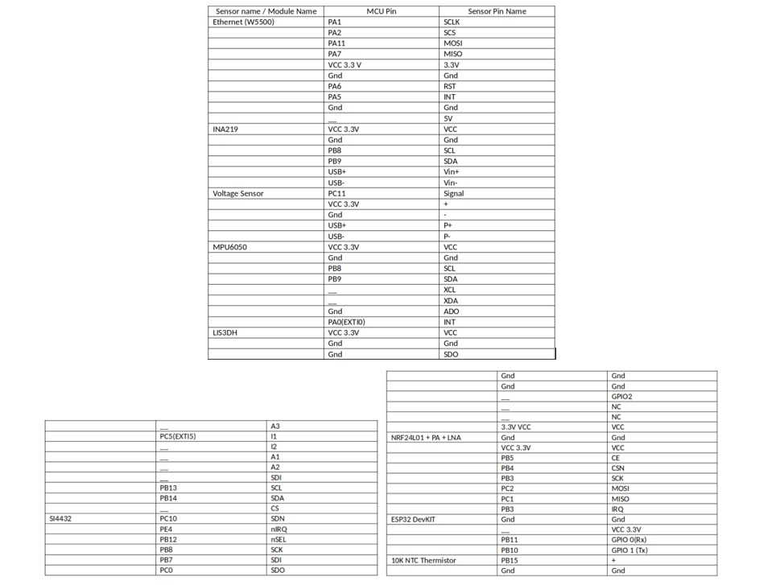
</p>
<p align="center"><i>Hardware circuit (left) · Pin-to-pin mapping (right)</i></p>

<p align="center">

</p>
<p align="center"><i>Numbered bring-up rig — ESP32 gateway (2), ST-Link/UART bridges (3, 11), sensor breakout modules (4, 5, 8, 9, 10, 13, 14), power bank supply (7), and USB/Ethernet interconnects (1, 6, 12)</i></p>

</details>

<details>
<summary><b>🧠 AI / Dataset Analysis</b></summary>
<br>

<p align="center">


</p>
<p align="center">


</p>
<p align="center"><i>Class balance, feature correlation, per-sensor spread, and pairwise feature relationships</i></p>

</details>

<details>
<summary><b>📈 MATLAB Robustness Analysis</b></summary>
<br>

<p align="center">
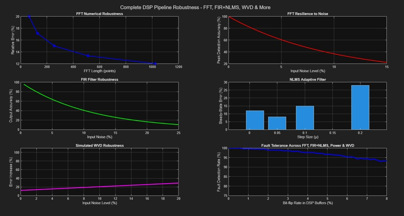
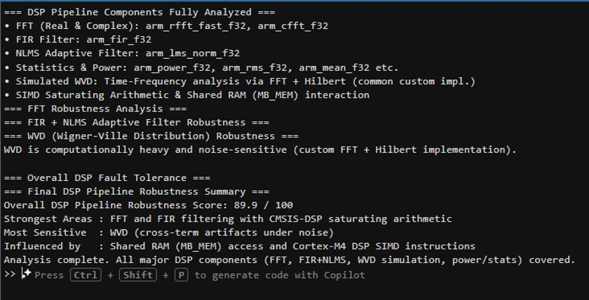
</p>
<p align="center"><i>DSP pipeline robustness — plots (left) · terminal run (right)</i></p>

<p align="center">
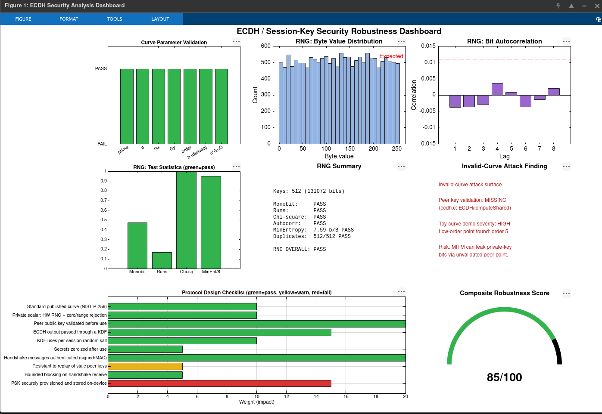
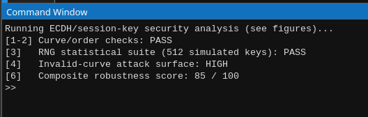
</p>
<p align="center"><i>Security pipeline robustness — plots (left) · terminal run (right)</i></p>

</details>

<details open>
<summary><b>📡 Live Alerting — ThingSpeak & Telegram</b></summary>
<br>

<p align="center">
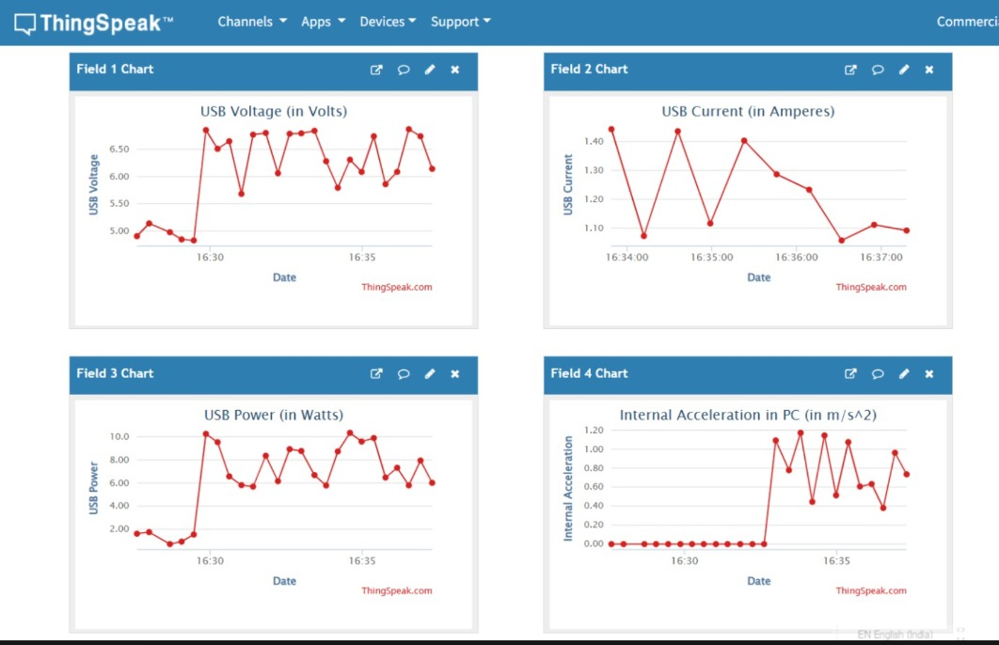
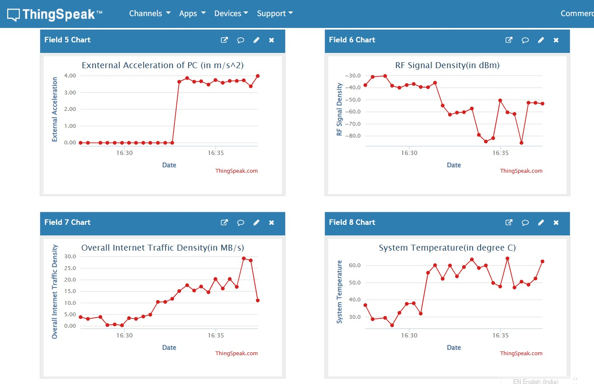
</p>
<p align="center"><i>Live ThingSpeak telemetry dashboards</i></p>

<p align="center">

</p>
<p align="center"><i>Fields 1–4: USB voltage, current, power, and internal PC acceleration during a live run</i></p>

<p align="center">

</p>
<p align="center"><i>Fields 5–8: external acceleration, RF signal density, overall internet traffic density, and system temperature — the exfiltration/encryption signature is visible as the step-change partway through each trace</i></p>

<p align="center">
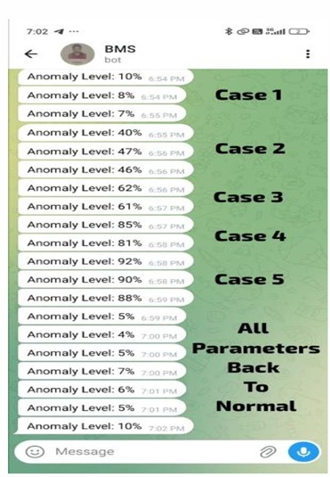
</p>
<p align="center"><i>Real-time Telegram alert</i></p>

<p align="center">

</p>
<p align="center"><i>Anomaly score climbing across five simulated attack cases, then settling back to baseline once parameters normalize — all pushed live to the Telegram bot</i></p>

</details>

> 🟢 **Reading the anomaly log:** each "Case" shows the model's anomaly score ramping up (5% → 92% across Cases 1–5) as ransomware-like behavior intensifies, then dropping back to baseline ("All Parameters Back To Normal") once the triggering condition clears — demonstrating both detection sensitivity and recovery.

> 📌 **Adding new images?** Drop them in the matching `media_pics/` subfolder and reference them the same way — the layout above is designed to stay in sync with that structure.

---

## 🧰 Tech Stack

<div align="center">

| Layer | Technology |
|---|---|
| **MCU** | STM32WB55 (Cortex-M4) |
| **Gateway** | ESP32 |
| **Bootloader Security** | ECDSA-P256 signature verification |
| **Transport Security** | ECDH key exchange + symmetric encryption |
| **Signal Processing** | Wigner-Ville Distribution, Compressive Sensing (CMSIS-DSP) |
| **AI/ML** | On-device neural network (Keras-trained, C-header inference) |
| **RTOS** | FreeRTOS |
| **Alerting** | Telegram Bot API, ThingSpeak |
| **Analysis Tooling** | MATLAB, Jupyter/Colab |

</div>

---

## 🗺 Roadmap

- [ ] OTA-signed firmware updates
- [ ] Expanded sensor fusion (additional RF bands)
- [ ] Model quantization for lower-power inference
- [ ] Web dashboard alternative to ThingSpeak

---

## 📄 License

Licensed under the **Apache License 2.0** — see [LICENSE](LICENSE) for details.

<div align="center">
<sub>⭐ If RansomShield is useful to you, consider starring the repo.</sub>
</div>
